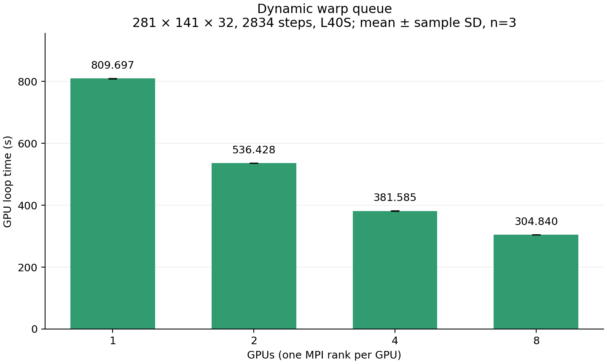

# EU3D CUDA/MPI

三维反应流求解器。MPI 负责域分解和反应任务迁移，CUDA 执行对流与反应计算。当前版本按 Nchem 分桶，每个 warp 动态领取同一桶内最多 32 个格点，完成后继续领取。

## 当前结果

CX3 L40S，281×141×32 网格，2834 步，每个 rank 使用一张 GPU，每个配置运行 3 次。

| GPU 数 | GPU loop 均值 (s) | 样本标准差 (s) | 相对同批静态分桶耗时下降 |
|---:|---:|---:|---:|
| 1 | 809.697 | 0.525 | 15.10% |
| 2 | 536.428 | 0.171 | 22.19% |
| 4 | 381.585 | 0.928 | 23.43% |
| 8 | 304.840 | 0.517 | 28.25% |



图表只展示当前动态版。同批静态分桶日志用于复核耗时下降。数值场已从集群取回，本地各规模保留动态模式第一次运行的输出；大型数据单独分发，不随普通 Git 提交。

## 目录

| 目录 | 内容 |
|---|---|
| `solver/` | 源码、输入、Makefile、测试和 PBS 运行脚本 |
| `analysis/` | 当前结果绘图与日志分析脚本 |
| `output_1/`、`output_2/`、`output_4/`、`output_8/` | 按 MPI 进程数分类的网格参数、负载、结果检查和计时 |
| `results/summary/` | 跨 GPU 规模的汇总表 |
| `results/figures/` | 当前动态版性能图 |
| `results/analysis/` | 当前动态版的计时、通信量和 rank 调度分析 |
| `docs/` | 方法、结果和运行说明 |
| `tools/` | 文件与实验记录检查 |

## 构建与运行

需要 CUDA、MPI 和 NVIDIA GPU。PBS 脚本针对 CX3 L40S。

```bash
cd solver
make -j4 ARCH=-arch=sm_89 NUMERIC_MODE=native
bash submit_queue_all.sh
```

运行时创建 `output_<MPI进程数>/`，其中 `grid/` 存网格，`load/` 存负载，`results/` 存数值场，`time_record/` 存计时。PBS 在临时目录运行，再将日志和结果归档到 `solver/intragpu_results/`。

仓库顶层按相同结构整理已取回的数据：`grid/` 为网格输入参数，`load/` 为日志提取的负载记录，`results/` 为当前动态版数值场和检查记录，`time_record/` 为计时和原始日志。独立的运行时网格检查文件未取回，但数值场文件本身包含 X/Y/Z 坐标。数据来源与哈希见 `RECOVERED_DATA.json`。

阅读：[方法](docs/METHODS.md) · [结果](docs/RESULTS.md) · [复现](docs/REPRODUCING.md) · [文件来源](docs/PACKAGING.md) · [检查记录](docs/VALIDATION.md)。
